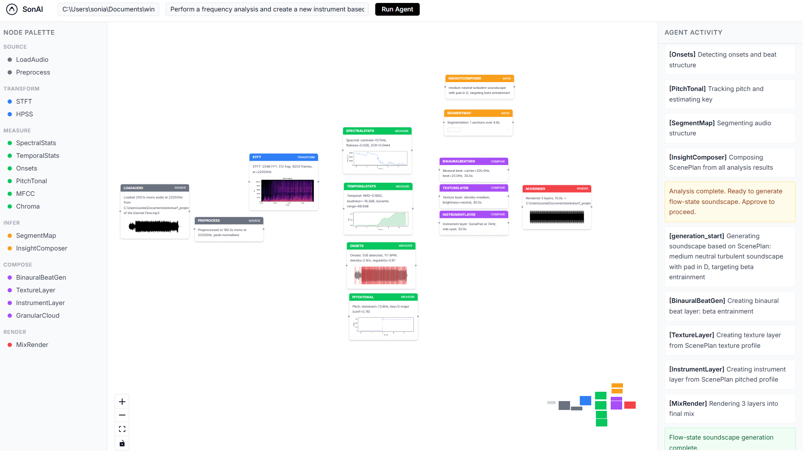

# SonAI — Audio Intelligence Node Editor

## Website
- [SonaAI](https://slab28.github.io/SonAI)
## Demo assets
- [Demo video](https://slab28.github.io/SonAI/#demo)
- [Screenshot](https://github.com/SLab28/SonAI/blob/main/artifacts/demo/step-5-complete-graph.png)

AI-native node editor for general audio signal analysis and non-vocal, flow-state soundscape generation.




## What it does
1. Drop audio files onto the canvas
2. State an objective (e.g. "Analyse this ambient recording and generate a calmer gamma-flow version")
3. An AI agent places analysis nodes, runs them, derives insights, and assembles a generation graph
4. SuperCollider renders the result as a non-vocal soundscape

## Stack
- Frontend: React 18 + TypeScript + React Flow + Vite
- Backend: Python 3.12 + FastAPI + FastMCP
- Agent: Claude (Anthropic API) with tool-use loop + deterministic fallback
- Analysis: librosa
- Synthesis: SuperCollider 3 via python-osc

## Quick Start

### 1. Configure your API key

Copy the example env file and add your Anthropic key:

**macOS / Linux:**
```bash
cp .env.example .env
```

**Windows (Command Prompt):**
```cmd
copy .env.example .env
```

**Windows (PowerShell):**
```powershell
Copy-Item .env.example .env
```

Then open `.env` in any text editor and replace `your-api-key-here` with your
real key:

```
ANTHROPIC_API_KEY=sk-ant-...
```

> `.env` is listed in `.gitignore` — git will never track or commit it.
> Only `.env.example` (which contains no real keys) is checked in.

### 2. One-command startup

The startup scripts install nothing — they just launch the backend and frontend
in parallel. Run `--setup` on first use to install dependencies.

**Windows (Command Prompt or PowerShell):**
```
start.bat --setup
```

**Linux / macOS / WSL:**
```bash
./start.sh --setup
```

After the first run, drop the `--setup` flag:
```
start.bat        # Windows
./start.sh       # Linux / macOS / WSL
```

This starts:
- FastAPI backend on http://localhost:8000
- Vite frontend on http://localhost:5173

Press `Ctrl+C` in the frontend window to stop. On Windows, close the
"SonAI Backend" window separately.

### Prerequisites

| Tool | Version | Install |
|------|---------|---------|
| Python | 3.12 | https://www.python.org/downloads/ |
| uv | latest | https://docs.astral.sh/uv/getting-started/installation/ |
| Node.js | 18+ | https://nodejs.org/ |
| pnpm | latest | `npm install -g pnpm` or https://pnpm.io/installation |
| SuperCollider | 3.x (optional) | https://supercollider.github.io/ |

> **Note:** SuperCollider is only required for audio synthesis/rendering.
> The node editor UI and analysis tools work without it.

### Manual startup (step by step)
```bash
# Install Python deps
uv sync

# Install frontend deps
cd frontend && pnpm install && cd ..

# (Optional) Start SuperCollider server
python -m backend.sc.boot

# Start backend
uv run uvicorn backend.main:app --reload --port 8000

# In a second terminal — start frontend
cd frontend && pnpm dev
```

## Read First
- AGENTS.md — project rules and boundaries for coding agents
- SPEC.md — product specification and data contracts
- TASKS.md — phase-gated task list (start here)
- ARCHITECTURE.md — system diagrams and API contracts

## Docs
- docs/node-schemas.md — all typed schemas
- docs/mcp-tool-registry.md — all MCP tools
- docs/sc-synth-library.md — SuperCollider SynthDef catalogue
- docs/flow-state-parameters.md — neuroscience parameters

## Skills (for coding agents)
- .claude/skills/audio-analysis-node.md
- .claude/skills/generation-pipeline.md
- .claude/skills/mcp-tool-creation.md
- .claude/skills/supercollider-osc.md
- .claude/skills/react-flow-node.md
